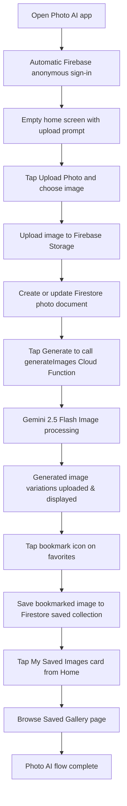

# Photo AI

Photo AI is a Flutter application that transforms user photos into social-ready looks by combining Google Gemini image generation with Firebase-backed persistence.

## Table of Contents

- [Photo AI](#photo-ai)
  - [Table of Contents](#table-of-contents)
  - [Overview](#overview)
  - [Key Features](#key-features)
  - [Tech Stack](#tech-stack)
  - [Architecture Overview](#architecture-overview)
    - [End-to-End Flow (Mermaid)](#end-to-end-flow-mermaid)
  - [Setup Instructions](#setup-instructions)
  - [Project Structure](#project-structure)
  - [Security Approach](#security-approach)
  - [Development Tips](#development-tips)
  - [Additional Documentation](#additional-documentation)

## Overview

Users upload a photo, trigger AI-assisted restyling, and browse the generated results inside a polished mobile UI. Anonymous Firebase authentication keeps each user's gallery isolated while Firestore and Cloud Storage persist originals and generated outputs. The experience is optimized for a delightful progress flow, rich visuals, and the ability to save favorite variations.

## Key Features

- **One-tap photo upload** with gallery picker, inline replacement, and reset controls.
- **AI style generation pipeline** that produces four curated looks per photo while visualizing progress and errors clearly.
- **Animated result gallery** with shimmer states, bookmarking, and full-screen preview for generated images.
- **Saved collection** that automatically restores previous generations from Firestore when the app launches and is instantly accessible from the home screen via a dedicated "My Saved Images" card and gallery page.

## Tech Stack

- **Framework**: Flutter (Material 3, Provider for state management)
- **Backend**: Firebase Authentication (anonymous), Cloud Firestore, Cloud Storage, **Cloud Functions**
- **AI Services** (Backend Only): Google Gemini 2.5 Flash Image (image generation)
- **Tooling**: Shimmer and CachedNetworkImage for UI polish

## Architecture Overview

Photo AI follows a layered architecture that separates presentation, domain logic, and infrastructure services. Provider manages UI state, while repository classes encapsulate the integrations with Firebase. **All AI API calls are routed through Firebase Cloud Functions** to protect API keys and enforce security. The flow is intentionally linear so each step can report progress, handle errors, and persist intermediate results.

1. **Authentication** – The app signs users in anonymously and stores a persistent UID using secure storage.
2. **Image upload** – Original photos are uploaded to Firebase Storage under `users/{uid}/original/` and registered in Firestore.
3. **Cloud Function call** – Flutter client calls `generateImages` Cloud Function with the uploaded image URL.
4. **Gemini generation** – Cloud Function streams four variations from **Gemini 2.5 Flash Image** while enforcing a “same-scene” prompt and uploads each output into `users/{uid}/generated/`.
5. **Result delivery** – Public Storage URLs are returned to the client (or signed URLs if the IAM permission is enabled) and rendered in the UI with save/unsave controls.
6. **Persistence** – Generated links and saved selections are stored in Firestore for future sessions.

### End-to-End Flow (Mermaid)



## Setup Instructions

Follow these steps to get the application running locally. See [SETUP.md](SETUP.md) for expanded guidance, rationale, and troubleshooting.

1. **Install prerequisites** – Ensure Flutter 3.9.x+ is available and run `flutter --version` to confirm.
2. **Fetch dependencies** – Clone the repository and install packages:

   ```bash
   git clone https://github.com/IlhamGhaza/photo_ai.git
   cd photo_ai
   flutter pub get
   ```

3. **Configure Firebase** – Download `google-services.json` and `GoogleService-Info.plist`, or rerun `flutterfire configure` if using a different Firebase project.

4. **Deploy Cloud Functions** – Deploy the backend functions to Firebase:

   ```bash
   cd functions
   npm install
   firebase functions:env:set GEMINI_API_KEY="YOUR_GEMINI_API_KEY"
   firebase deploy --only functions
   cd ..
   ```

5. **Run the app** – Launch on your target device:

   ```bash
   flutter run
   ```

## Project Structure

```text
lib/
  core/            # Theme, constants, services (auth, env helpers)
  data/            # Models and repositories (Functions, Firestore, Storage)
  presentation/    # Home screen widgets, providers, and pages
functions/         # Firebase Cloud Functions (Node.js backend)
  index.js         # Main Cloud Functions implementation
  package.json     # Node.js dependencies
assets/
  images/          # App branding assets
android/ios/       # platform-specific Firebase configuration
```

## Security Approach

- **Zero client-side secrets** – **NO API keys or AI logic in the mobile app**. Everything is in Cloud Functions.
- **Cloud Functions security** – **ALL AI API calls** (Gemini) are routed through Firebase Cloud Functions, protecting API keys from client exposure and reverse engineering.
- **Backend-only AI logic** – Mobile app only calls Cloud Functions with image URLs. All prompt generation and AI processing happens server-side.
- **User isolation** – Anonymous authentication issues a unique UID per device and stores it securely using `FlutterSecureStorage` so each gallery remains private.
- **Per-user storage** – Generated assets are written to `users/{uid}/generated/`. By default files are made public for quick previews; teams that need private access can grant the Cloud Functions service account the `roles/iam.serviceAccountTokenCreator` role and switch to signed URLs.
- **Data persistence** – Firebase Security Rules (see `firestore.rules` and `storage.rules`) restrict reads and writes to authenticated users' own documents and images.
- **Authentication enforcement** – Cloud Functions validate that all requests come from authenticated users before processing.

## Development Tips

- Test Cloud Functions locally with emulators: `cd functions && npm run serve`
- Use Flutter's DevTools or `flutter run -d chrome` for rapid UI iteration.
- Monitor Cloud Functions logs: `cd functions && npm run logs`

## Additional Documentation

- [SETUP.md](SETUP.md) — complete environment, Firebase, Cloud Functions, and secrets configuration guide.
- [SECURITY_ARCHITECTURE.md](SECURITY_ARCHITECTURE.md) — **detailed security architecture and zero-trust client design**.
- [functions/README.md](functions/README.md) — detailed Cloud Functions documentation, deployment, and troubleshooting.
