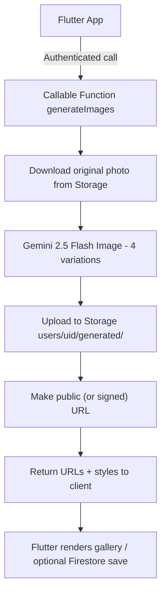

# Photo AI Cloud Functions

Firebase Cloud Functions for the Photo AI application. These functions handle secure Google Gemini image generation and act as the only place where AI credentials live.

## Overview

The Cloud Functions serve as a secure backend layer that:
- Protects API keys from client exposure
- Streams Gemini 2.5 Flash Image generations on behalf of the client
- Uploads generated assets to user-specific Firebase Storage folders
- Returns Storage URLs (or signed URLs if configured) to the Flutter app
- Enforces authentication and authorization rules

## Functions

### `generateImages`

Main callable that generates four AI-styled images from an uploaded photo.

**Input:**
```json
{
  "imageUrl": "https://firebasestorage.googleapis.com/..."
}
```

**Output:**
```json
{
  "success": true,
  "generatedUrls": [
    "https://storage.googleapis.com/<bucket>/users/UID/generated/generated_123.png",
    "https://storage.googleapis.com/<bucket>/users/UID/generated/generated_124.png",
    "https://storage.googleapis.com/<bucket>/users/UID/generated/generated_125.png",
    "https://storage.googleapis.com/<bucket>/users/UID/generated/generated_126.png"
  ],
  "styles": [
    "Luxury Supercar Showcase",
    "Jetset Rooftop Lounge",
    "Tropical Beach Escape",
    "European City Stroll"
  ],
  "timestamp": "2025-01-01T00:00:00Z"
}
```

> **Note:** The response includes `styles` (and legacy `stylesUsed` for backward compatibility). The Flutter client currently reads the URLs directly and optionally writes them to Firestore.

**Security:**
- Requires authenticated user
- Validates input parameters
- Uses server-side API keys
- Writes files to `users/{uid}/generated/`
- Defaults to `file.makePublic()` so clients can immediately preview images (switch to signed URLs if desired)

### `healthCheck`

Simple health check endpoint for testing deployment.

**Output:**
```json
{
  "status": "healthy",
  "timestamp": "2024-01-01T00:00:00Z",
  "version": "1.0.0"
}
```

## Setup

### 1. Install Dependencies

```bash
cd functions
npm install
```

### 2. Configure Environment Variables

Set your Gemini API key in Firebase config (Cloud Functions v2 syntax):

```bash
firebase functions:env:set GEMINI_API_KEY="YOUR_GEMINI_API_KEY"
```

To view the current values:

```bash
firebase functions:env:get
```

> If you still rely on `firebase functions:config:set`, the key will **not** be available to v2 functions. Use `functions:env` or set the key through the Firebase Console → Functions → Configuration.

### 3. Local Development

Run functions locally with emulators:

```bash
npm run serve
```

The functions will be available at:
- `http://localhost:5001/YOUR_PROJECT_ID/us-central1/generateImages`
- `http://localhost:5001/YOUR_PROJECT_ID/us-central1/healthCheck`

### 4. Deploy to Firebase

Deploy all functions:

```bash
firebase deploy --only functions
```

Deploy a specific function:

```bash
firebase deploy --only functions:generateImages
```

## Architecture



## Security Considerations

1. **API Key Protection** – Gemini API key lives in Firebase config and is read via `defineString`. No client access.
2. **Authentication** – The callable enforces Firebase Authentication and rejects unauthenticated calls.
3. **Input Validation** – Ensures `imageUrl` is a string and the user is authorized to access it.
4. **Per-user storage** – Output images are written to `users/{uid}/generated/` ensuring isolation.
5. **Optional privacy** – To use signed URLs instead of public files, grant the Functions service account `roles/iam.serviceAccountTokenCreator` and swap the storage logic.
6. **Error Handling & Logging** – Generates descriptive logs for Gemini, upload, and timeout failures.

## Error Handling

Functions return appropriate HTTPS errors:

- `unauthenticated` - User not authenticated
- `invalid-argument` - Invalid input parameters
- `internal` - Server-side processing error

## Monitoring

View function logs:

```bash
npm run logs
```

Or in Firebase Console:
- Functions → Logs
- Monitor execution time, errors, and invocations

## Cost Optimization

- Functions use 512MB memory allocation
- 9-minute timeout for AI generation
- Maximum 10 concurrent instances
- Efficient caching and error handling

## Testing

Test the health check function:

```bash
curl -X POST https://us-central1-YOUR_PROJECT_ID.cloudfunctions.net/healthCheck \
  -H "Content-Type: application/json" \
  -d '{}'
```

## Troubleshooting

### Function deployment fails
- Check Node.js version (requires Node 22)
- Verify Firebase CLI is up to date: `npm install -g firebase-tools`
- Check Firebase project permissions

- Verify API key is set: `firebase functions:env:get`
- Check API quota in Google Cloud Console
- Ensure Gemini API is enabled in your project

### Image generation fails
- Verify network connectivity from Cloud Functions
- Review function logs for specific errors

## Development Workflow

1. Make changes to `index.js`
2. Test locally with emulators: `npm run serve`
3. Deploy to Firebase: `npm run deploy`
4. Monitor logs: `npm run logs`
5. Test from Flutter app

## Additional Resources

- [Firebase Cloud Functions Documentation](https://firebase.google.com/docs/functions)
- [Google Gemini API Documentation](https://ai.google.dev/docs)
- [Pollinations.ai Documentation](https://pollinations.ai/docs)
